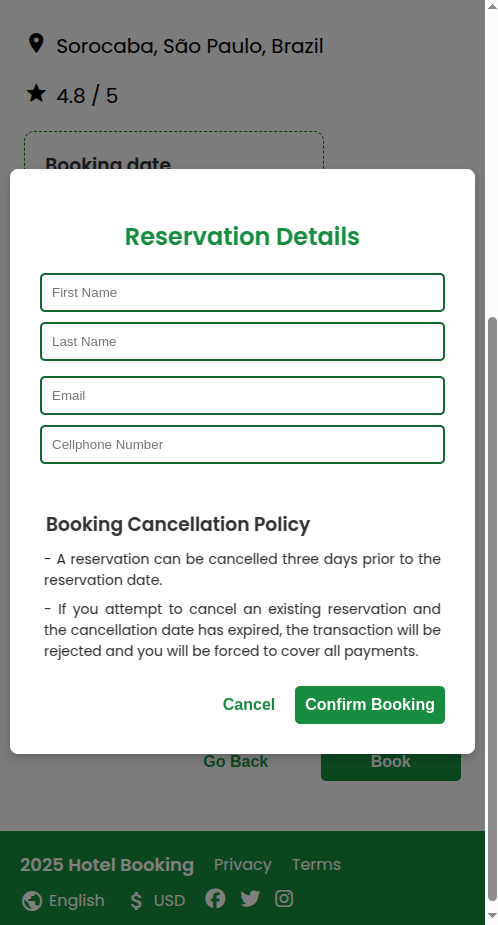

# Hotel Search System

> ⚠️ Important Notice ⚠️
This repository is public for reference purposes only. Copying, modifying, or reusing any part of this code is not allowed. If you need more information, please contact me.

## Overview

This project is an MVP for a hotel search and booking system. The backend is built using Express.js, TypeScript, and Mongoose. On the frontend, Angular 16 delivers a dynamic and responsive user interface. The system relies on MongoDB, a NoSQL database, to handle and store hotel listings, user reservations, and other essential data efficiently.

> Obs: Each project has its own README that may help run the application.

## Screenshots

 
 
 
 
 
 
